# UR_IV / AI Studio Pro

Windows용 AI 이미지 생성 데스크톱 앱입니다. PyQt6 창 안의 `QWebEngineView`가 Vue 3 SPA를 띄우고, 두 층은 `QWebChannel`로 통신합니다.
생성·검색·마스킹 같은 무거운 작업은 Python이 맡고, 화면은 Vue가 그립니다.
백엔드는 Stable Diffusion WebUI(A1111/Forge)와 ComfyUI 중 **한 번에 하나만** 연결할 수 있습니다. 이미 실행 중인 백엔드에 연결해도 되고,
앱이 Forge Neo·ComfyUI를 설치하고 실행하게 할 수도 있습니다. 그 밖에 Danbooru 태그 데이터셋 검색, 이미지 편집기, 일괄 처리,
로컬 LLM 대화, 영상·만화 제작 기능도 함께 들어 있습니다.

<p align="center">
  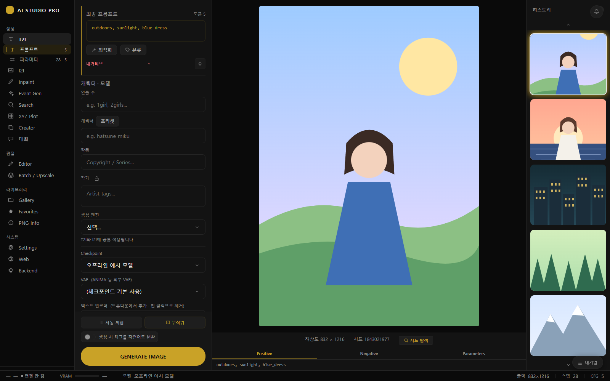
</p>
<p align="center"><sub>T2I 기본 화면 — 왼쪽 프롬프트 열, 가운데 미리보기와 Positive/Negative/Parameters 바, 오른쪽 히스토리</sub></p>

> 스크린샷은 개발 서버의 목업 페이지(`dev/theme-audit.html?readme`)에서 합성 그림과 샘플 데이터로 찍은 것이라, 화면 속 그림은 실제로 생성한 이미지가 아닙니다.
> 다시 찍는 방법은 [`frontend/dev/THEME-PREVIEW.md`](frontend/dev/THEME-PREVIEW.md)에 있습니다.

---

## ✨ 핵심 기능

- **생성**: T2I에는 Hires.fix와 LoRA 스택을 붙일 수 있고, ADetailer(2슬롯)·SAM3 Mask(ControlNet 포함)·ANIMA 가이던스는 I2I·Inpaint에도 적용됩니다.
  생성 엔진은 Standard와 Krea2(ComfyUI 전용) 중에서 고르며, 시드 탐색(3×3)과 XYZ Plot도 지원합니다.
- **백엔드**: WebUI(A1111/Forge)나 ComfyUI 중 하나에 연결합니다. 앱이 설치·실행하는 관리형 런타임을 쓰거나 이미 설치해 둔 백엔드를 연결할 수 있습니다.
  ComfyUI는 동봉 노드 팩만 설치돼 있으면 일반 작업에 워크플로 JSON이 필요 없습니다.
- **Danbooru 데이터**: `2026_07` 릴리스 검색(G/S/Q/E, AND/OR)과 이벤트 시퀀스 생성(Event Gen)을 지원하며, 데이터는 첫 실행 때 자동으로 내려받습니다.
- **프롬프트 도구**: 블록/텍스트 모드, Undo/Redo, 토큰 수, 한국어 라벨·한글 검색 자동완성, 제외 규칙 9종, 와일드카드, 즉석 와일드카드,
  조건부 규칙, 프리셋, 워크플로우 프로파일, A/B 테스트, 생성 통계를 제공합니다.
- **AI 어시스트(Ollama)**: 태그 확장·유사 태그·자연어→태그 변환, 자연어 캡션·장면 묘사·번역·`창의 생성`, AI 네거티브를 지원합니다.
  생성할 때 태그를 자연어로 바꾸는 기능도 있습니다.
- **대화**: Ollama나 LM Studio의 로컬 LLM과 대화할 수 있습니다. JSON Schema 구조화 출력을 지원하고, 이야기 도중 바로 이미지·영상 생성을 요청할 수도 있습니다.
- **편집·일괄 처리**: 15가지 도구를 갖춘 편집기와 YOLO+SAM 자동 검열, 배경 제거(rembg), 워터마크 기능을 제공합니다.
  일괄 처리에는 리사이즈·업스케일·ADetailer·SAM3·캡션(CAFormer/ToriiGate) 모드가 있습니다.
- **Creator**: MiniMax H3로 영상을, AI 스토리보드로 만화(리빙 코믹)를 만들 수 있습니다. 인물의 특징을 유지한 채 편집하는 Krea2 아이덴티티 편집도 지원합니다.
- **대기열·자동화**: 대기열에서는 일시정지·재개, 위/아래 이동, 항목 편집, 다중 삭제를 할 수 있고 예상 완료 시간(ETA)도 보여 줍니다.
  자동 모드는 매수 제한·시간 제한·무제한 중에서 고를 수 있으며, 실패 시 재시도와 프롬프트 덱을 지원합니다.
- **운영**: 검증된 모델 다운로드, GitHub 릴리스 기반 앱 업데이트, 외부 프로그램용 Generation API, 브라우저에서 쓰는 웹 모드를 갖추고 있습니다.

---

## 📦 요구 사항

설치하기 전에 다음을 준비하세요.

- **Windows 10/11**: 런처가 `.bat` 파일이고 일부 패키지(`triton-windows`)가 Windows 전용입니다.
- **Python 3.11**(py 런처 포함): 검증에 쓴 venv는 Python 3.11.9입니다. `requirements.txt`에는 최소 버전만 적혀 있지만, 그 venv에 설치된
  numpy 2.3·pandas 3.0·onnxruntime 1.29·av 18·rembg 2.0.78은 Python 3.11 이상 전용이라 3.10 조합은 확인하지 않았습니다.
  런처는 3.11 → 3.10 → `py -3` → PATH의 `python` 순서로 찾기 때문에, 3.11이 없으면 다른 버전으로 venv가 만들어질 수 있습니다.
- **NVIDIA GPU 권장**: 이미지 생성은 백엔드가 맡지만, SAM3·YOLO·배경 제거 같은 앱 안의 로컬 처리에는 GPU가 쓰입니다.
  그리고 GPU가 있든 없든 앱에는 CUDA 빌드 torch가 필요합니다. `core/check_requirements.py`가 cu128 인덱스에서 torch를 설치하는데,
  설치에 실패하거나 CPU 빌드만 남으면 앱이 시작되지 않습니다. 다른 CUDA 버전이 필요하면 그 파일의 `_TORCH_CUDA_INDEX`를 바꾸세요.
- **디스크**: 첫 실행 때 venv 패키지 약 6 GB(그중 torch 약 4 GB)와 Danbooru 데이터 약 1.25 GB를 내려받습니다.
  합쳐서 7 GB가 넘으니 여유 공간을 확인하세요. 받는 데 시간도 꽤 걸립니다.
- **Git**: `git clone`, 관리형 백엔드, 앱 업데이트에 필요합니다.
- **백엔드**: Forge/A1111 WebUI(`--api`)나 ComfyUI가 필요하며, **첫 실행 전에 둘 중 하나를 실행해 두어야 합니다**([처음 실행](#처음-실행-데스크톱) 참고).
- **관리형 런타임을 쓸 때**: `uv`(Python 3.13을 알아서 내려받습니다)나 py 런처로 찾을 수 있는 Python 3.13이 필요합니다. 앱 자체는 지금처럼 앱 venv의 Python으로 실행됩니다.
- **선택 사항**:
  - Ollama: AI 어시스트, ToriiGate·비전 캡션, 대화에 쓰입니다(기본 `http://localhost:11434`).
  - LM Studio: 대화 탭에서만 사용합니다(기본 `http://localhost:1234`).
  - `uv`: 설치돼 있으면 앱 패키지를 설치할 때도 pip보다 먼저 씁니다.
  - Node.js 20.19+ 또는 22.12+: 프론트엔드를 다시 빌드하거나 테스트할 때만 필요합니다(Vite 8의 요구 사항이며, vitest는 Node 23을 지원하지 않습니다).

### Python 패키지

패키지 목록은 [`requirements.txt`](requirements.txt) 한 곳에서 관리하며, 앱이 시작될 때 `core/check_requirements.py`가 빠진 패키지를 설치합니다.
torch/torchvision은 별도 인덱스에서 받기 때문에 `requirements.txt`에 없습니다. 반면 SAM3(`sam3`, `triton-windows`), YOLO(`ultralytics`), CAFormer 태거(`onnxruntime`),
영상(`av`), 배경 제거(`rembg`, `pymatting`), VRAM 표시(`nvidia-ml-py`) 패키지는 이 목록에 들어 있습니다.

아래 패키지는 자동으로 설치되지 않으니, PATH의 다른 Python이 아니라 앱 venv에 직접 설치하세요. `git+` 주소로 설치하려면 Git이 필요합니다.

```bat
:: MobileSAM (가볍고 빠른 bbox 기반 SAM)
venv\Scripts\python.exe -m pip install git+https://github.com/ChaoningZhang/MobileSAM.git
:: SAM v1
venv\Scripts\python.exe -m pip install segment-anything
```

---

## 🚀 설치 / 실행

### 처음 실행 (데스크톱)

먼저 백엔드를 켜 두세요. Forge/A1111은 `--api` 옵션으로, ComfyUI는 평소대로 실행하면 됩니다.
시작 화면(백엔드 선택)은 연결에 성공해야 닫히고 '백엔드 없이 시작' 버튼도 없어서, 백엔드가 없으면 앱 안으로 들어갈 수 없습니다.
관리형 런타임은 앱에 들어간 뒤에야 설정 → **런타임 · 엔진**에서 설치할 수 있습니다.

```bat
git clone https://github.com/UR-al/UR_IV.git
cd UR_IV
.\new_run_main_ui.bat
```

`.\`를 붙이면 cmd와 PowerShell 모두에서 실행되며, 탐색기에서 더블클릭해도 됩니다.
첫 실행 때는 창이 뜨기 전에 콘솔에서 패키지를 설치합니다. 이 콘솔 창을 닫으면 앱도 함께 종료되니 설치가 끝날 때까지 그대로 두세요.

1. `new_run_main_ui.bat`는 `venv\`가 없으면 새로 만듭니다(`py -3.11` → `py -3.10` → `py -3` → PATH의 `python` 순서로 찾습니다).
   이어서 pip을 준비하고 이전 크래시 로그를 보존한 뒤 `venv\Scripts\python.exe new_main_ui.py`를 실행합니다.
   기존 venv가 망가져 실행되지 않으면 `venv.incompatible-…`로 옮겨 두고 새로 만듭니다.
2. 앱이 시작되면 `core/check_requirements.py`가 누락된 패키지를 설치합니다. CUDA 빌드 torch/torchvision(cu128 인덱스)을 먼저 받은 다음
   `requirements.txt`의 나머지를 설치하며, PATH에 `uv`가 있으면 pip보다 `uv`를 우선합니다. 이 과정을 마친 뒤에도 필요한 패키지가 없으면 앱이 시작되지 않습니다.
3. 그다음 `core.fetch_data`가 Hugging Face에서 Danbooru 데이터(약 1.25 GB) 가운데 없거나 크기가 다른 파일만 골라 내려받습니다.
4. 스플래시 화면이 지나고 백엔드 선택 화면이 뜨면 주소를 확인하고 WebUI 또는 ComfyUI를 고르세요.
   ComfyUI 워크플로 칸은 비워 두어도 되며, 그러면 앱이 그래프를 직접 만듭니다. API 형식 JSON을 지정하는 것은 고급 옵션입니다.

앱 안에서 업데이트를 설치하려면 `git clone`으로 내려받은 저장소여야 합니다. 압축 파일(ZIP)로 받았다면 업데이트 알림만 표시됩니다.

### 첫 이미지 만들기

1. **T2I** 탭 왼쪽 프롬프트 열의 `Checkpoint`에서 모델을 고르세요(목록은 연결된 백엔드에서 불러옵니다).
2. 캐릭터·작품·메인 같은 프롬프트 칸에 태그를 입력하세요. 해상도·스텝 같은 설정은 레일의 `파라미터`에서 바꿀 수 있습니다.
3. `GENERATE IMAGE`(또는 `Ctrl+G`)를 누르면 결과가 가운데 미리보기와 오른쪽 히스토리에 표시되고, 이미지는 기본 출력 폴더인 `generated_images/`에 저장됩니다.

### 실행 파일

| 파일 | 용도 |
|---|---|
| `new_run_main_ui.bat` | **평소에도 이 런처를 쓰세요.** venv 생성·복구, pip 준비, 크래시 로그 보존 후 데스크톱 창 실행. 앱 업데이트 후 재시작에도 사용 |
| `run_gui.bat` | 같은 데스크톱 창을 띄우는 가벼운 런처. 이미 잘 동작하는 venv 필요, venv 생성·복구 없음 |
| `run_WEB_gui.bat` | 웹 모드(`web_main_ui.py`). 이미 만들어진 venv 필요 |

세 런처 모두 앱 업데이트가 진행 중이면 최대 120초까지 기다리고, 그래도 끝나지 않으면 안내를 띄운 뒤 종료합니다.
런처를 거치지 않으려면 `venv\Scripts\python.exe new_main_ui.py`를 실행하세요. 이때도 의존성 확인과 데이터 준비 과정을 똑같이 거칩니다.

### 데이터 다시 받기

명령 프롬프트(cmd)에서 저장소 폴더로 이동한 뒤 다음 명령을 실행하세요.

```bat
venv\Scripts\activate.bat
python -m core.fetch_data
```

처음 설치할 때 데이터를 받지 못하면 앱이 시작되지 않습니다. 다만 기존 데이터가 있으면 경고만 표시하고 그대로 시작합니다.
저장소 접근이 거부되면 같은 창에서 `hf auth login`을 실행한 뒤 다시 시도하세요.

### 백엔드 연결

| 방법 | 설명 |
|---|---|
| 직접 실행 | Forge/A1111 WebUI: `--api`로 실행(기본 연결 주소 `http://127.0.0.1:7860`)<br>ComfyUI: 기본 연결 주소 `http://127.0.0.1:8188`<br>다른 포트(ComfyUI 데스크톱 앱 등)로 실행했다면 선택 화면에서 주소 수정 |
| 관리형 런타임 | 설정 → **런타임 · 엔진**에서 Forge Neo(`Haoming02/sd-webui-forge-classic`, `neo` 브랜치)나 ComfyUI(`Comfy-Org/ComfyUI`)의 설치·업데이트·시작·중지 |
| 기존 설치 연결 | 같은 화면에서 설치 폴더 지정<br>Forge: `launch.py`와 `venv`/`.venv` 필요<br>ComfyUI: `main.py`와 `venv`/`.venv`, 또는 Windows 포터블 구성(`python_embeded`) 필요<br>연결한 설치는 앱의 업데이트 대상에서 제외 |

- **백엔드 바꾸기**: 시작한 뒤 백엔드를 바꾸려면 설정 → **일반**(또는 **네트워크**)의 `백엔드 관리`를 누르세요.
- **설치 위치**: 관리형 런타임은 `user_data/managed_backends/<engine>/`에 설치되며, `AISTUDIO_MANAGED_BACKENDS_DIR`로 위치를 바꿀 수 있습니다.
  venv는 엔진마다 따로 두며, `uv`가 있으면 `uv venv --python 3.13`으로, 없으면 `py -3.13`으로, 둘 다 없으면 앱의 Python으로 만듭니다.
  관리형 런타임을 설치하거나 업데이트하려면 Git이 PATH에 있어야 합니다.
- **포트**: 관리형 런타임은 Forge 17860번, ComfyUI 18188번부터 50개 범위 안에서 처음으로 비어 있는 포트를 씁니다.
- **자동 시작**: 설치된 관리형 런타임에 자동 시작이 켜져 있으면, 데스크톱 앱을 실행할 때 백엔드 선택 화면을 건너뛰고 그 런타임을 바로 띄웁니다.
- **ComfyUI 동봉 노드 팩**: 앱이 만드는 기본 그래프는 [`comfy_custom_nodes/ai_studio_forge_parity`](comfy_custom_nodes/ai_studio_forge_parity/README.md)의 노드로 구성됩니다.
  이 팩이 있으면 일반 T2I/I2I/인페인트/업스케일/ADetailer/SAM3 작업에 워크플로 JSON이 필요 없지만, 없으면 일반 T2I도 실패합니다.
  - 앱에 설정된 로컬 ComfyUI 런타임에서는 처음 생성할 때(워크플로 컴파일 직전) 팩이 `custom_nodes`로 자동 복사됩니다.
    조건은 두 가지로, 연결 주소가 로컬(loopback)이면서 설정된 런타임과 포트가 같아야 하고(런타임 주소가 없으면 포트는 비교하지 않습니다),
    런타임의 확장 폴더 쓰기 권한을 승인해 두어야 합니다. 복사가 끝나면 앱이 띄운 ComfyUI는 자동으로 재시작되고, 외부에서 띄운 ComfyUI는 직접 재시작하라는 안내가 나옵니다.
  - 직접 띄운 ComfyUI에는 자동으로 들어가지 않습니다. 이 폴더를 `ComfyUI/custom_nodes/`에 복사한 뒤 ComfyUI를 재시작하거나,
    그 설치를 설정 → **런타임 · 엔진**에서 기존 설치로 연결하고 확장 폴더 쓰기를 승인하세요.
- **필요한 확장**: WebUI 백엔드에서 ADetailer를 쓰려면 Forge/A1111에 ADetailer 확장이 있어야 하고, ComfyUI에서는 Impact Pack(FaceDetailer)과
  Impact Subpack(UltralyticsDetectorProvider)이 필요합니다. 생성 중 SAM3 Mask에는 Forge의 `sam-extra`(forge_sam3_extension) 확장이,
  ANIMA 가이던스에는 그 확장 v0.21.2 이상이 필요합니다.
- **Krea2**: ComfyUI에서만 동작합니다. I2I 아이덴티티 편집에는 Identity Edit·TextFusion LoRA와 Krea2 Edit 커스텀 노드가 추가로 필요합니다.
- **Generation API**: 외부 프로그램에서 생성 작업을 받거나 승인된 다른 Forge/ComfyUI로 넘기는 기능이며, 기본값은 꺼짐입니다.
  설정 → **네트워크**에서 활성화하면 `127.0.0.1:17990`에서 Bearer 토큰 인증으로 요청을 받고, A1111 API 일부와 호환됩니다. 규격과 예시는 [`docs/generation_api.md`](docs/generation_api.md)를 참고하세요.

### 모델 넣을 곳

- **직접 띄운 백엔드**는 해당 백엔드의 `models` 폴더를 그대로 이용합니다.
- **관리형 런타임과 모델 다운로드**는 공용 모델 루트를 쓰며, 루트는 다음 순서로 정해집니다.
  1. 환경 변수 `FORGE_MODELS_ROOT`
  2. `C:\sd-webui-forge-neo\models` 또는 `C:\sd-webui-forge-classic\models`가 있으면 그 폴더
  3. 둘 다 없으면 `user_data\models\` (앱이 `Stable-diffusion`, `diffusion_models`, `Lora`, `VAE`, `text_encoder`, `upscale_models` 하위 폴더를 만듭니다)
- **공용 모델 루트의 폴더들**은 관리형 Forge에는 `--ckpt-dirs`·`--lora-dirs` 같은 인자로, 관리형 ComfyUI에는 추가 모델 경로 파일로 전달됩니다.
- **설정 → Forge**에서는 체크포인트·LoRA·VAE·텍스트 인코더 폴더를 따로 지정할 수도 있습니다(`config/forge_model_paths.json`).

**편집기·SAM 모델**

- **`Editor_models/`**(대문자 E, 프로젝트 루트)는 편집기 자동 검열용 폴더입니다. 새로 clone한 저장소에는 없으며, 앱이 처음 필요할 때 만듭니다. 직접 만들어 두어도 됩니다.
  - YOLO 검출 모델(`.pt`/`.onnx`/`.safetensors`)은 직접 준비해 넣으면 자동으로 인식되며, `Editor_models/yolo_config.json`으로 추가하거나 비활성화할 수 있습니다.
  - SAM 체크포인트도 여기에 둡니다. `sam3.pt`는 Hugging Face `facebook/sam3`(접근 승인 필요)에서, `mobile_sam.pt`는 MobileSAM 저장소에서 내려받으세요.
    SAM3 체크포인트는 `.pt` 형식만 지원합니다(`.safetensors` 불가).
  - SAM 설정이 `AUTO`면 MobileSAM → SAM3 → FastSAM → SAM v1 순서로 파일을 고릅니다.
    고른 파일에 필요한 패키지가 없으면 SAM3로 넘어가지 않고 YOLO 박스 마스크를 쓰므로, 그럴 때는 `SAM3`를 직접 선택하세요.
- **SAM3 어휘 파일**(`bpe_simple_vocab_16e6.txt.gz`)은 처음 필요할 때 `facebook/sam3`에서 `image_cache/sam3_assets`로 자동으로 내려받습니다.
- **생성 중 SAM3 Mask**(Forge/ComfyUI)의 체크포인트 목록은 `Editor_models`가 아니라 위 공용 모델 루트의 `sam3` 폴더에서 읽습니다.
- **CAFormer 캡션 모델**(`animetimm/caformer_s18.dbv4-full`)은 자동으로 내려받지 않으니 로컬 HF 캐시나 직접 지정한 폴더에 미리 받아 두세요.
  ToriiGate 캡션에는 Ollama 모델 `hf.co/DraconicDragon/ToriiGate-0.5-GGUF:BF16`을 사용합니다.

### 웹 모드

`run_WEB_gui.bat`는 창을 띄우지 않고 `frontend_dist`를 HTTP로 제공합니다.
이 런처는 venv를 만들지 않으니, 먼저 `new_run_main_ui.bat`로 한 번 실행해 venv를 만들고 백엔드·런타임 설정을 끝내 두세요.

- 기본 주소는 `http://127.0.0.1:7800`(WebSocket 7801)이며, 포트는 `AISTUDIO_HTTP_PORT` / `AISTUDIO_WS_PORT`로 바꿀 수 있습니다.
- 실행할 때마다 새 세션 토큰이 든 주소(`…/?token=…`)를 콘솔에 출력하고 기본 브라우저로 엽니다(토큰은 이번 실행 동안만 유효합니다).
  첫 접속 때 세션 쿠키가 설정되며, 쿠키 없이 보낸 요청은 401 오류로 거부됩니다.
- '백엔드 선택' 창은 매번 호스트 PC 화면에 뜨며, 여기서 백엔드를 고릅니다('백엔드 없이 시작'도 있습니다).
  브라우저에서는 백엔드를 바꿀 수 없고, 관리형 런타임 자동 시작도 건너뜁니다.
- LAN의 다른 기기에서 접속하려면 바인드 주소를 지정한 **같은 콘솔 창에서** 런처를 실행해야 합니다. cmd에서는 `set "AISTUDIO_BIND=0.0.0.0"`,
  PowerShell에서는 `$env:AISTUDIO_BIND="0.0.0.0"`을 입력한 뒤 `.\run_WEB_gui.bat`를 실행하세요(더블클릭하면 이 값이 전달되지 않습니다).
  Windows 방화벽에서는 HTTP·WebSocket 포트 두 개(기본 7800·7801)를 허용해야 합니다.
- 모델 다운로드, 조명 편집·손 재구성, 런타임 설치·시작, 앱 업데이트 설치, Generation API·모델 경로 변경, 설정 복원·앱 재시작처럼
  호스트 전용인 기능은 웹 모드에서 사용할 수 없습니다. 다만 파일·폴더 선택 창은 LAN에 공개했을 때만 막힙니다.
- 레일의 **Web**·**Backend** 탭은 데스크톱 창 전용이라, 웹 모드에서는 눌러도 브라우저에 아무것도 나오지 않습니다.
- 크래시 로그는 `logs/last_crash_web.log`에 남습니다.

### 앱 업데이트

설정 → **앱 업데이트**는 GitHub Releases(`UR-al/UR_IV`)에 올라온 정식 `vX.Y.Z` 릴리스를 찾으며, 자동 확인이 기본으로 켜져 있어 12시간마다 새 버전을 살펴봅니다.
설정 화면에서는 자동 확인 켜기/끄기와 버전 건너뛰기만 할 수 있습니다. 확인 간격을 바꾸려면 `config/app_update.json`의 `intervalHours`를 직접 고치세요(1–168시간으로 제한됩니다).
현재 버전은 `VERSION` 파일에 적혀 있습니다.

- **설치 조건**: 원격이 `UR-al/UR_IV`인 git 저장소이고, detached HEAD가 아닌 브랜치에 체크아웃돼 있으며, 현재 버전의 기준 릴리스를 식별할 수 있어야 합니다.
- **설치 방식**: `git merge --ff-only`로만 설치하며 reset이나 stash는 하지 않습니다. 바뀐 파일과 겹치는 로컬 수정이 있거나 다른 앱 인스턴스가 실행 중이면 설치를 거부합니다.
- **완료 후**: 앱이 `new_run_main_ui.bat`로 다시 시작되며, 결과는 `logs/updates/last_result.json`에 기록됩니다.
  새로 필요해진 패키지는 재시작할 때 `core/check_requirements.py`가 설치합니다.

### 모델 다운로드

설정 → **모델 다운로드**는 `core/model_download_catalog.json`에 등록된 팩을 내려받습니다.
팩은 Krea2(t2i/edit/hires), MiniMax H3(t2v/i2v/turbo/ref2va/audio), Anima(base/2.9B/3.8B + Semantic Connector v2)를 합쳐 11개이며,
R-ESRGAN 4x+(`RealESRGAN_x4plus.pth`)는 `Krea 2 · Hires 업스케일` 팩에 함께 들어 있습니다.
모든 파일의 크기와 SHA-256을 검증하고, 다운로드가 끊기면 이어서 받습니다. 파일은 주 엔진의 모델 폴더가 있으면 그곳에, 없으면 `user_data/models/…`에 저장됩니다.
이 기능은 데스크톱 창에서만 쓸 수 있습니다.

### 프론트엔드를 고쳤을 때

`frontend_dist/`가 커밋돼 있으므로 실행만 할 때는 Node가 필요 없습니다. `frontend/src`를 고쳤다면 다시 빌드해야 변경이 반영됩니다.

```bat
cd frontend
npm install
npm run build
```

Python 코드를 고쳤다면 앱을 재시작해야 반영됩니다. 자세한 명령은 [`frontend/README.md`](frontend/README.md)에 있습니다.

---

## 🗂️ 탭 가이드

왼쪽 세로 레일(NavRail)에는 16개 탭이 네 그룹으로 나뉘어 있으며, 레일은 196px 너비로 펼치거나 52px로 접을 수 있습니다.
세부 모드가 있는 탭을 선택하면 그 아래에 모드가 **서랍 항목**으로 펼쳐집니다(예: T2I의 `프롬프트 | 파라미터`, Batch의 `일괄 | 업스케일 | …`).

### 생성 탭

| 탭 | 설명 |
|---|---|
| **T2I** | 텍스트→이미지<br>왼쪽 열: 레일의 `프롬프트`/`파라미터`로 내용 전환(파라미터 열은 `Esc`나 X로 닫기)<br>가운데: 실시간 미리보기, 진행률, 해상도·시드, `시드 탐색`, Positive/Negative/Parameters 바<br>오른쪽 히스토리 우클릭 메뉴: 즐겨찾기, I2I/인페인트/에디터로 보내기, 비교, ADetailer, 프롬프트 당겨오기, `다음 큐에 추가`, 경로 복사, 휴지통 이동<br>하단: GENERATE, 취소, 자동, 무작위, `생성 시 태그를 자연어로 변환` |
| **I2I** | `img2img` 모드: 원본 업로드·드래그(갤러리·히스토리에서 보낸 .tif·.apng·.avif 포함), 프롬프트 덮어쓰기(비우면 T2I 프롬프트 사용), denoise, 크기 조정, 고급(steps/CFG/seed — 범위를 넘는 seed는 잘라 쓰지 않고 알림), 실험 · 조명 편집<br>생성 중에는 시작 버튼 잠금, 옆의 취소 버튼으로 중지<br>생성 엔진이 Krea2면 아이덴티티 편집으로 전환<br>`SAM3 정밀화` 모드: Target/Exclude/Replacement를 지정한 SAM3 마스크 img2img, 연쇄 정밀화 지원 |
| **Inpaint** | 마스크 편집기<br>도구: 사각 선택(M), 올가미(L, 자유/자석), 마스크 브러시(B), 지우개(E, 브러시/박스/올가미 모양)<br>브러시 크기, denoise, 프롬프트 덮어쓰기, 마스크 blur·padding, 고급 설정, 마스크 Undo/Redo<br>기본으로 꺼져 있는 [실험 · 손 형태 재구성](docs/experimental-hand-reconstruction.md) 패널 포함 |
| **Event Gen** | 캐릭터·작품·일반 태그·작가·제외 태그·스텝 수·등급으로 이벤트 검색<br>결과: 이벤트 목록과 단계별 시퀀스<br>외모/의상/배경 유지, 단계별로 T2I에 보내기, 반복 횟수, `큐에 추가`, 지금 생성, `.parquet` 가져오기/내보내기 |
| **Search** | 캐릭터/작품/일반 태그/작가 필드로 Danbooru 데이터셋 검색(필드마다 제외 입력)<br>등급 칩, 50만 건 상한 또는 무제한, AND/OR, `.parquet` 가져오기/내보내기, 필터 관리, 정밀 검색<br>단일 보기: `프롬프트로 사용`/`대기열에 추가`<br>목록 보기: 정렬과 페이지(50개) |
| **XYZ Plot** | 연결된 백엔드에서 불러온 축 사용(`축 새로고침`)<br>축 값 입력: 선택, S/R, 범위(`20-40:5`)<br>최대 256 조합, CSV 내보내기<br>앱이 실행하지 않는 확장 축은 따로 표시<br>Krea2 미지원 |
| **Creator** | `영상`: MiniMax H3 T2V/I2V/V2V, 24 FPS 고정, 오디오 유지·생성<br>`만화`: AI 스토리보드, 최대 6컷, Auto/Grid/Vertical/Strip/Hero 레이아웃, 말풍선, PNG/WebP 또는 리빙 코믹(영상)으로 내보내기<br>`Krea2`: 원본과 참조를 이용한 아이덴티티 편집<br>영상과 Krea2는 ComfyUI 필요 |
| **대화** | Ollama·LM Studio 로컬 LLM과 대화<br>스레드(새 스레드 `Ctrl+N`), 지침 프리셋, JSON Schema 구조화 출력, 모델별 옵션, 이미지·텍스트 첨부, Markdown 내보내기<br>요청 모드: 자동/대화만/이미지 생성/영상(H3) |

<p align="center">
  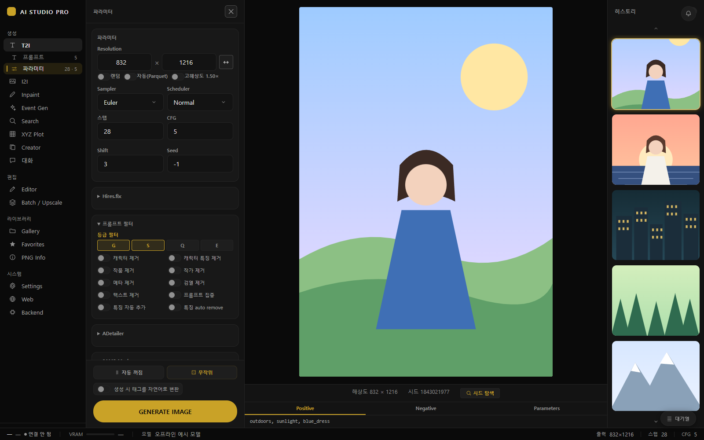
  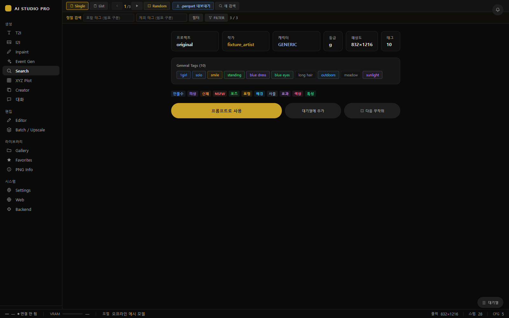
</p>
<p align="center"><sub>왼쪽: T2I 파라미터 열(해상도, Sampler/Scheduler, Hires.fix, 프롬프트 필터, ADetailer) · 오른쪽: Search 단일 보기(카테고리별 색 태그, 프롬프트로 사용·대기열에 추가)</sub></p>

<p align="center">
  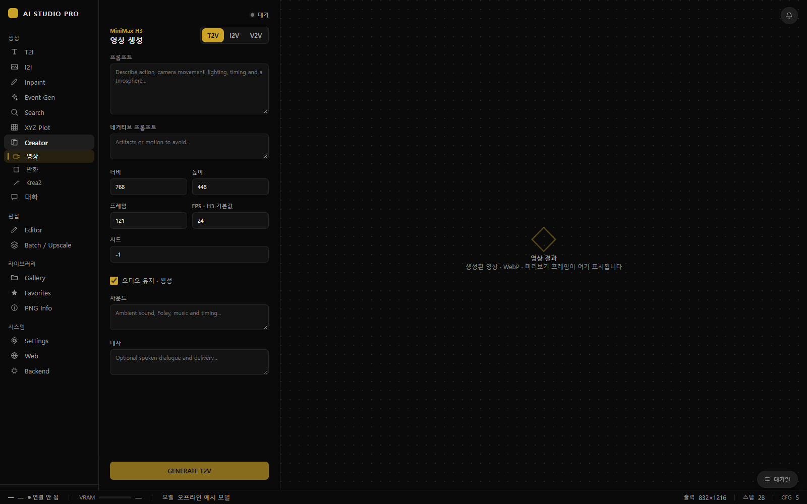
  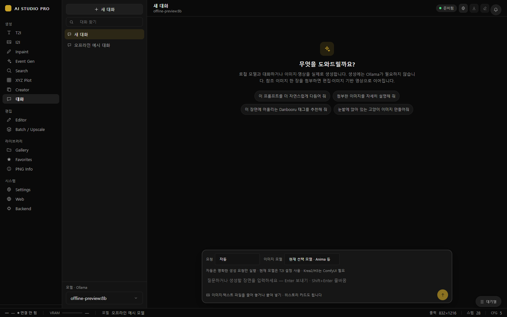
</p>
<p align="center"><sub>왼쪽: Creator 영상(MiniMax H3 T2V/I2V/V2V) · 오른쪽: 대화(스레드 목록, 요청 모드·이미지 모델·Ollama 모델 선택)</sub></p>

### 편집 탭

| 탭 | 설명 |
|---|---|
| **Editor** | 생성 없는 이미지 편집<br>도구 15개(마스크 도구와 그리기 레이어 도구)<br>`보정` 탭: 밝기·대비·필터, 히스토그램·레벨·커브<br>`효과` 탭: 모자이크·검은 띠·블러, AI 검열, 배경 제거, 워터마크<br>`변형` 탭: 회전·뒤집기, 자르기, 크기 변경, 원근 보정, 선택 영역 이동 후 인페인트로 보내기<br>복구용 자동 저장(5분마다) |
| **Batch / Upscale** | 왼쪽 설정, 오른쪽 파일 그리드<br>모드 5가지: `일괄`(리사이즈·PNG/JPEG/WEBP 변환), `업스케일`, `ADetailer`(ETA·중지), `SAM3`(인페인트 또는 마스크만), `캡션`(CAFormer 태그, ToriiGate 자연어, 둘의 조합, 다른 Ollama 비전 모델 중에서 골라 `.txt` 저장) |

<p align="center">
  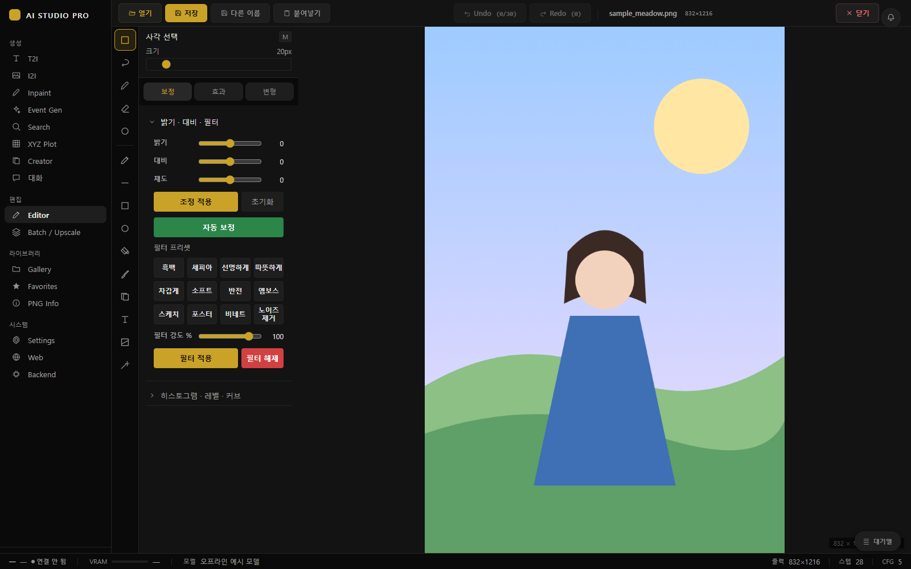
</p>
<p align="center"><sub>Editor — 위쪽 파일·Undo/Redo 막대, 왼쪽 도구 모음, <code>보정</code> 탭의 밝기·대비·채도와 자동 보정, 필터 프리셋</sub></p>

### 라이브러리 탭

| 탭 | 설명 |
|---|---|
| **Gallery** | 폴더 기반 이미지·영상·오디오 보기(스크롤하면 이어서 불러오기)<br>EXIF 검색, 날짜/이름 정렬, 썸네일 크기 조절<br>큰 보기: 이름 변경, EXIF 저장, I2I/인페인트/에디터, `프롬프트 사용`<br>메타 사이드바: `T2I에서 사용`<br>우클릭 메뉴: 즐겨찾기, 정보 보기, I2I/인페인트/에디터로 보내기, 비교, ADetailer, 휴지통 이동 |
| **Favorites** | 즐겨찾기 그리드<br>EXIF 검색, 정렬, 썸네일 크기<br>뷰어: 항목별 복사(프롬프트/네거티브/원본/파라미터), T2I/I2I/Inpaint/Editor 보내기 카드 |
| **PNG Info** | `PNG Info` 모드: Prompt/네거티브/Parameters/Raw 항목별 복사, ComfyUI 메타데이터 보기, 보내기 카드(T2I 프롬프트, 즉시 생성, I2I, Inpaint, Editor, 즐겨찾기)<br>`메타 이식`: 이 이미지의 프롬프트·파라미터·워크플로를 다른 이미지에 새 PNG로 써 넣기<br>`비교` 모드: 두 이미지 슬라이더 비교, 파라미터 차이·프롬프트 차이 보기, GIF 내보내기 |

<p align="center">
  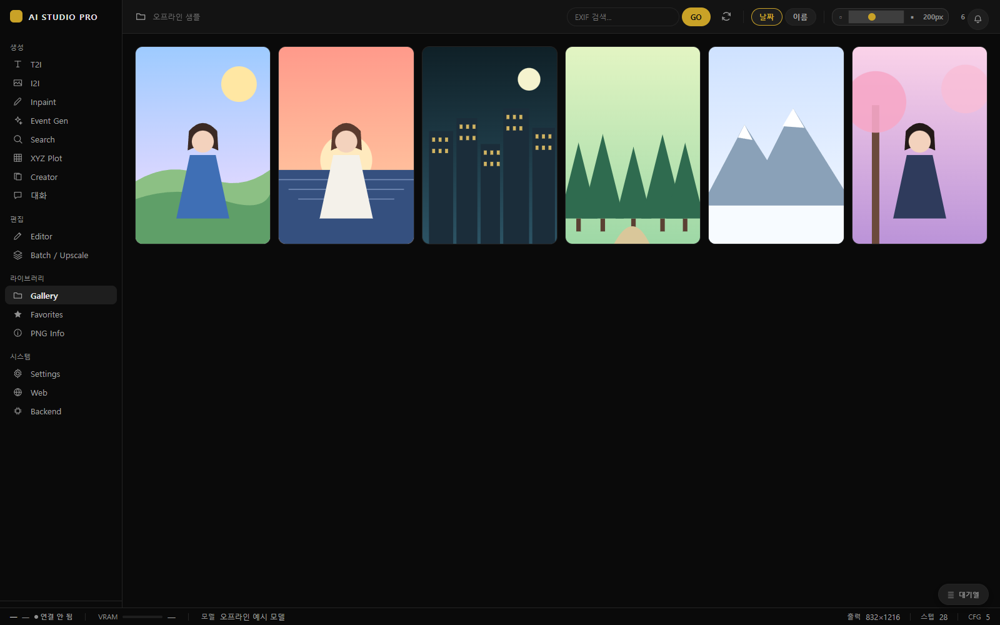
  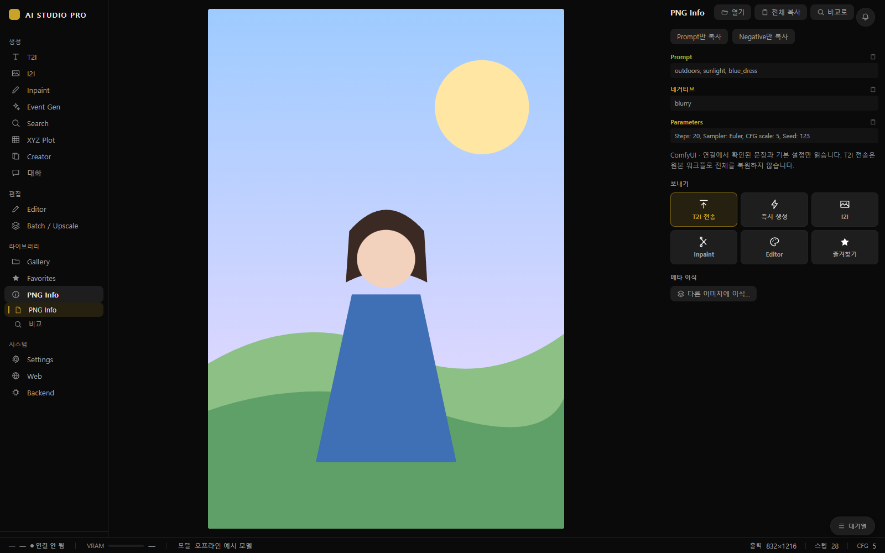
</p>
<p align="center"><sub>왼쪽: Gallery(EXIF 검색, 날짜/이름 정렬, 썸네일 크기) · 오른쪽: PNG Info(항목별 복사, 보내기 카드, 메타 이식)</sub></p>

### 시스템 탭

| 탭 | 설명 |
|---|---|
| **Settings** | 14개 섹션([설정 화면 구성](#설정-화면-구성))<br>설정 화면에 포커스가 있을 때 `Ctrl+F`로 검색, 일치 항목 강조 |
| **Web** | 내장 브라우저(PyQt 네이티브 화면, 데스크톱 창 전용)<br>뒤로·홈·주소창·`← AI Studio`<br>기본 홈 `hijiribe.donmai.us`, 로그인 상태 유지 |
| **Backend** | 연결된 Forge/ComfyUI의 웹 UI를 앱 안에 표시(PyQt 네이티브 화면, 데스크톱 창 전용)<br>새로고침, 외부 브라우저로 열기<br>탭을 처음 열 때 불러오기 |

### 공통 화면 요소

- 데스크톱에서 시작하면 전체 화면 **백엔드 선택**(WebUI / ComfyUI, URL 확인, ComfyUI 워크플로 선택)이 먼저 뜨고, 연결에 성공해야 닫힙니다. 관리형 런타임에 자동 시작이 켜져 있으면 이 단계를 건너뜁니다.
- 하단 **상태 표시줄**에는 백엔드·VRAM·모델이 표시됩니다. VRAM 표시를 누르면 모델 언로드를 요청하며, VRAM 사용량이 위험 수준이면 먼저 확인 창을 띄웁니다.
- **대기열 서랍**에서는 시작, 일시정지/재개, 중지, 다중 선택 삭제, 전체 비우기, 위/아래 이동, 편집을 할 수 있습니다. 다만 생성 중인 항목은 옮기거나 지울 수 없습니다.
- **탭 순서**는 설정 → 워크스페이스에서 드래그해 바꿀 수 있으며, 같은 그룹 안에서만 옮겨집니다. 순서를 한 번 저장하면 목록에 없는 Editor·Creator·대화·Web·Backend는
  각 그룹의 끝에 원래 순서대로 붙습니다(예: Editor가 Batch / Upscale 아래로 갑니다).

### 설정 화면 구성

<p align="center">
  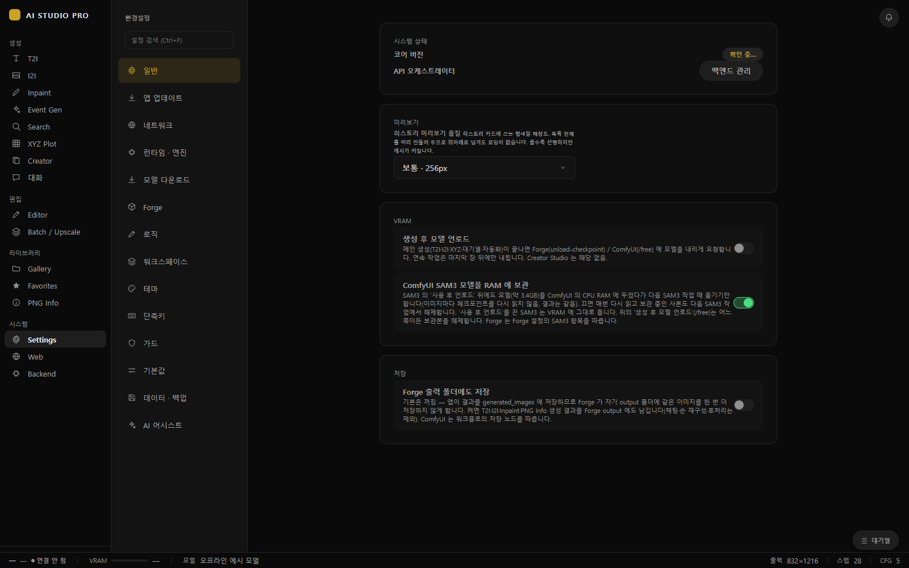
</p>
<p align="center"><sub>설정 → 일반 — 14개 섹션 사이드바, 히스토리 미리보기 품질, VRAM <code>생성 후 모델 언로드</code>, ComfyUI SAM3 모델 RAM 보관, Forge 출력 폴더에도 저장</sub></p>

| 섹션 | 내용 |
|---|---|
| 일반 | 시스템 상태·`백엔드 관리`, 히스토리 미리보기 품질, VRAM(`생성 후 모델 언로드`, 기본 꺼짐), ComfyUI SAM3 모델 RAM 보관, Forge 출력 폴더에도 저장 |
| 앱 업데이트 | 업데이트 확인·설치 후 재시작(위 [앱 업데이트](#앱-업데이트)) |
| 네트워크 | Generation API, Forge/WebUI·ComfyUI 연결, 외부 생성 작업 |
| 런타임 · 엔진 | 관리형/기존 설치 백엔드, 공유 모델 소스, 확장 폴더, 추가 인자, 설치·업데이트·시작·중지, 확장 저장소 설치 |
| 모델 다운로드 | 검증된 모델 팩 다운로드, H3 캐시, Spectrum 가속(실험), Comfy 호환성·워크플로 설정 |
| Forge | Forge Neo 모델 경로 |
| 로직 | 프롬프트 정리 옵션, 태그 블록 모드, 갤러리 메타 패널, 자동 작품 태그, 히스토리 깜빡임, 전역 저장 |
| 워크스페이스 | 탭 순서 |
| 테마 | 테마 선택(아래 라이트 테마 예시) |
| 단축키 | 단축키 안내, 히스토리 점프 수식키(Shift/Ctrl/Alt) |
| 가드 | ANIMA 해상도 가드 |
| 기본값 | UI 배율, T2I 기본값, EDITOR 기본값(브러시·효과 세기·YOLO 신뢰도·스냅 반경), 첫 실행 확장 기본값(Hires.fix·ADetailer·SAM3) |
| 데이터 · 백업 | 설정·사용자 자료 백업 |
| AI 어시스트 | Ollama 서버·모델, 비전 모델 추천, `이미지 생성 시 LLM 언로드`, 기능별 지침([설명](docs/ai-assist-instructions.md)) |

<p align="center">
  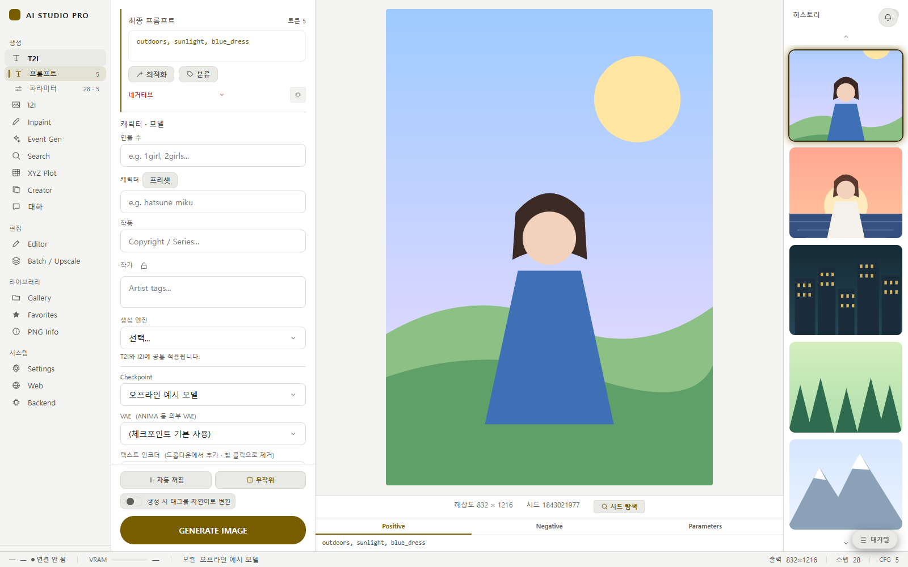
</p>
<p align="center"><sub>설정 → 테마에서 라이트 테마로 바꾼 T2I 화면</sub></p>

---

## 🏗️ 아키텍처

```
new_main_ui.py / web_main_ui.py
  └─ core.app_startup.prepare_application()   의존성 확인 → 데이터 준비

QMainWindow  GeneratorMainUI (ui/generator_main.py + ui/generator_*.py·일부 ui/*_actions.py 믹스인)
└── QStackedWidget (_main_stack)
    ├── 0: QWebEngineView ─ Vue SPA (frontend_dist/index.html)
    ├── 1: BrowserTab   (Web,     tabs/browser_tab.py)
    └── 2: BackendUITab (Backend, tabs/backend_ui_tab.py)

QWebChannel 객체
├── backend : ui/vue_bridge.py (VueBridge — @pyqtSlot / pyqtSignal)
└── studio  : ui/studio_qwebchannel.py → core/studio_application.py
              (런타임 · Generation API · 앱 업데이트 · 모델 경로 작업)

Vue SPA (frontend/src)
├── App.vue             백엔드 선택 · NavRail · 왼쪽 열(PromptPanel ↔ 파라미터 카드)
│                       · 가운데 router-view · 오른쪽 히스토리 · 대기열 · 상태 표시줄 · 모달
├── router.js           T2I = components/ImageViewer.vue, 나머지 = views/*View.vue 지연 로드
├── components/params/  파라미터 카드 (기본 · Hires.fix · 프롬프트 필터 · ADetailer · SAM3 Mask · LoRA)
├── components/managers/ 매니저 모달 (프리셋 · 가중치 · 와일드카드 · 프로파일 · 순서 · 즉석 WC · 통계)
├── composables/        use*.ts/js — 기능별 상태
├── stores/             widgetStore.js (위젯 값 동기화 + requestAction), appUpdateStore.ts
├── studio/             studio 채널 클라이언트
└── bridge.js           연결 (Qt 내장 / 웹 모드 WebSocket / 개발용 mock)

Python
├── backends/  WebUIBackend (A1111/Forge, /sdapi/v1) · ComfyUIBackend (페이로드 → API 그래프 컴파일)
├── workers/   QThread 워커 (생성 · 검색 · 이벤트 · ADetailer · SAM3 · 정밀화 · 업스케일 · 일괄 · 대화 · Ollama)
└── core/      Qt 없는 순수 로직 (대기열, 프롬프트 파이프라인, 런타임 관리, 데이터셋, 저장 경로 …)
```

- **Vue → Python**: `requestAction(name, payload)`이 `backend.onAction`을 거쳐 `GeneratorMainUI._handle_vue_action`으로 전달됩니다.
- **Python → Vue**: Vue에서 `onBackendEvent(name, cb)`로 `VueBridge` 시그널을 구독합니다.
- **위젯 프록시**: Python 코드는 `ui/widget_proxies.py`의 프록시로 Vue 상태를 읽고 씁니다.
  Vue의 `widgets.<id>` 키와 프록시의 `widget_id`가 같습니다(예: `widgets.character_input` ↔ `LineEditProxy(b, 'character_input')`).
- **Web·Backend 탭**: Vue 뷰가 아니라 PyQt 화면이라서, 레일에서 누르면 `native_tab_switch`로 `QStackedWidget`의 화면을 전환합니다.
- **웹 모드**: 창 없이 같은 `GeneratorMainUI`로 동작합니다. 허용 목록만 노출하는 `WebBridgeFacade`가 WebSocket으로 연결되며, 호스트 전용 작업은 막혀 있습니다.

---

## 📊 데이터셋과 검색 문법

### 데이터 파일

```
danbooru_optimized/
├── README.md                                 # 데이터 생성·검증 방법 (git 추적)
├── dataset_manifest.json                     # 활성 릴리스 2026_07 정의 (git 추적)
├── legacy_search_tags_before_2026_07.csv     # 구형 릴리스에만 있던 태그 보존 (git 추적)
├── danbooru_2026_07_{g,s,q,e}.parquet        # Search 등급별 shard (약 965 MB)
├── danbooru_sorted/danbooru_{g,s,q,e}.parquet  # Event Gen 그래프 shard (약 273 MB)
└── tags_dictionary.parquet                   # 영어 자동완성 사전
```

- `*.parquet`는 git에 포함돼 있지 않으며, 앱이 시작될 때 Hugging Face 데이터셋 `UR-AR/UR_IV`에서 없는 파일과 크기가 다른 파일만 내려받습니다.
- Search는 manifest(`format_version` 1)가 지정한 파일 이름만 사용하고 크기·행 수·스키마·SHA-256을 검증합니다. 구형 릴리스로 대체하거나 파일 이름을 추측하지 않습니다.
- Event Gen shard 크기가 manifest와 다르면 경고만 띄우고 실행을 막지는 않습니다.
- `legacy_search_tags_before_2026_07.csv`는 구형 `2025`·`2026`·`2026_06` 릴리스에만 있던 태그를 보존합니다(열: `tag`, `legacy_categories`, `legacy_releases`). 다만 Search shard를 대신하지는 않습니다.
- 데이터 재생성과 검증 방법은 [`danbooru_optimized/README.md`](danbooru_optimized/README.md)에 있습니다.
- **`tags_db/`**는 git에 포함된 태그 DB(약 39 MB)입니다. 자동완성 카탈로그, 한국어 태그 카탈로그, 별칭·함의, 캐릭터 데이터, 어휘 목록을 담고 있으며, 코드에서는 반드시 `manifest.json`을 거쳐 읽습니다. 자세한 내용은 [`tags_db/README.md`](tags_db/README.md)를 참고하세요.

### 자동완성

태그 입력칸은 영어는 2글자, 한글은 1글자부터 후보를 보여 줍니다.

- 영어 후보는 `tags_dictionary.parquet`(별칭은 `tags_db`)에서 가져옵니다. 먼저 카테고리 순서(general → character → copyright → artist → meta)대로, 같은 카테고리 안에서는 사용 횟수 순으로
  접두 일치 태그를 모으고, 이어서 별칭 일치와 일반 태그 포함 일치를 더해 최대 10개를 보여 줍니다. 후보마다 한국어 라벨이 붙습니다.
- 한글은 한국어 카탈로그의 **키워드**로 찾습니다. 예를 들어 `장발`을 입력하면 `long_hair`, `very_long_hair`가 나옵니다.

### Search 탭 검색 문법

검색 필드는 캐릭터·작품·일반 태그·작가 네 가지이고, 필드마다 제외 입력칸이 있습니다.
검색어는 소문자로 바꿔 비교하며, 공백과 밑줄(`_`)은 같은 것으로 취급합니다.

| 문법 | 의미 | 예 |
|---|---|---|
| `word` | 포함 | `girl` → `1girl`, `multiple girls` |
| `*word` | 완전 일치 | `*1girl` → 정확히 `1girl`만 |
| `_word` | 문자열 끝 일치 | `_hair` → `long hair`, `short hair` (문자열 기준이라 `armchair`도 일치) |
| `word_` | 문자열 시작 일치 | `hair_` → `hair ornament`, 그리고 `hair` 자체 |
| `_word_` | 명시적 포함 | `word`와 같음 |
| `[A\|B\|C]` | OR 그룹 (모드 무관) | `[blue_hair\|red_hair]` |
| `[A,B,C]` | AND 그룹 (모드 무관) | `[1girl,blue_hair]` |
| `[A\|B\|]` | **필드 와일드카드**: 마지막 항목이 비어 있으면 이 필드는 항상 통과 | `[tots\|alc\|]` → tots, alc, 또는 작품 제한 없음<br>중간의 `\|\|`나 맨 앞의 `\|`는 무시<br>AND 모드용(OR 모드에서 쓰면 필드끼리 OR로 묶여 모든 결과가 통과) |
| `,` | 모드에 따라 AND 또는 OR | AND: `a, b` = 둘 다 / OR: 둘 중 하나 |

- **AND/OR 모드**는 필드 사이의 결합 방식과 한 필드 안 콤마의 의미를 함께 정합니다.
- **제외 입력칸**에 넣은 조건은 모드와 상관없이 결과에서 제외됩니다. 다만 제외 입력칸 안의 콤마도 모드를 따르므로,
  AND 모드에서 `a, b`를 넣으면 둘 다 가진 결과만 빠집니다. 하나라도 가진 결과를 빼려면 `[a|b]`로 쓰세요.
- **등급 칩**은 GEN/SENS/QUES/EXPL이며, 기본으로 GEN만 켜져 있습니다.
- **상한**은 50만 건입니다. 결과가 이를 넘으면 무작위로 50만 건만 남기며, `무제한 ⚠`으로 상한을 해제할 수 있습니다.
- **정밀 검색**은 위 문법이 아니라 태그 단위 완전 일치로 동작합니다. 포함 조건은 모두 만족해야 하고, 제외 조건은 하나만 걸려도 빠집니다.

---

## ✍️ 프롬프트 문법

### 제외 규칙 (9종)

제외 규칙은 PromptPanel의 `제외 (로컬)` 칸에 입력하며, `관리` 창에서 어떤 태그가 걸리는지 미리 볼 수 있습니다.

| 제외 | 예외 (유지) |
|---|---|
| `단어` 포함 제외 | `~단어` 완전일치 유지 |
| `*단어` 완전일치 제외 | `~_단어` 접미 유지 |
| `_단어` 접미 제외 | `~단어_` 접두 유지 |
| `단어_` 접두 제외 | `~_단어_` 포함 유지 |
| `_단어_` 포함 제외 |  |

- 예외 규칙이 제외 규칙보다 우선하며, 비교할 때는 밑줄을 공백으로, 대문자를 소문자로 바꿔 맞춥니다.
- 이 규칙은 **데이터 태그를 프롬프트 칸에 채울 때**(Search 결과 적용, 랜덤 덱·자동화, 대기열 추가, 프롬프트 당겨오기)에만 적용됩니다.
  직접 입력한 프롬프트에는 생성할 때도 적용되지 않습니다.
- 캐릭터·작품·작가 칸에서는 `단어`, `_단어_`가 태그 전체와 같을 때만 걸리고, 접두·접미 규칙은 그대로 적용됩니다.
- 규칙은 콤마나 줄바꿈으로만 나누고 공백으로는 나누지 않습니다. 그래서 `long hair`는 규칙 하나이며, 콤마 없이 하나만 쓴 규칙(`_short`, `~_tank_top`)도 종류가 그대로 유지됩니다.
  키워드가 없는 규칙(`_`, `__`, `~`)은 무시합니다.
- 기호(`~`, `*`, `_`)만으로 된 조각이 줄 끝에 있으면 다음 줄과 합쳐 한 규칙이 됩니다(`~` 줄 다음에 `solo` 줄 → `~solo`). 같은 조각이 콤마 뒤나 맨 끝에 홀로 있으면 무시합니다.
- `관리` 창에서 규칙을 편집·삭제·추가하거나 예외를 클릭할 때, 그리고 블록 모드에서 고칠 때도 바뀐 규칙 부분만 수정합니다.
  그래서 한 줄에 규칙을 하나씩 쓰거나 카테고리별로 줄을 나눈 배치가 그대로 유지됩니다.
- `관리` 창의 초록 태그는 예외 규칙으로 유지되는 태그입니다(`~tank_` 같은 패턴 예외 포함). 태그를 클릭하면 `~태그`를 넣거나 빼고, 우클릭하면 `*태그`를 넣습니다.
  패턴 예외로만 유지되는 태그는 클릭해도 바뀌지 않으니 해당 패턴 규칙을 직접 고치세요.
- `config/default_excludes.txt`는 카테고리별로 정리한 **참고용** 목록입니다. 앱이 읽거나 적용하지 않으니 필요한 줄을 `제외 (로컬)` 칸에 직접 붙여 넣으세요.

### 와일드카드

스튜디오 도구 → **와일드카드**에서 파일을 관리하고 프롬프트에 넣을 수 있습니다. 치환은 같은 창의 `생성 시 치환` 스위치로 켜고 끄며, 기본값은 켜짐입니다.

| 문법 | 의미 |
|---|---|
| `__name__` / `~/name/~` | 같은 의미. `wildcards/name.txt`의 **모든 줄**에서 후보를 하나씩 골라 `, `로 연결 (한 줄 = 콤마로 나열한 후보) |
| `__name:n__` / `~/name:n/~` | 무작위 n줄만 골라 사용 |
| `[A\|B\|C]` | 프롬프트 어디서든 하나를 무작위로 선택 |
| `{A\|B\|C}` | 무작위 선택. 중첩 가능(`{{red\|blue} hair\|ponytail}`) |
| `{A:3\|B:1}` | 가중치 선택 |
| `{1-10}` / `{1-10:2}` | 범위 안의 숫자 (`:2`는 간격) |

- 빈 줄과 `#`으로 시작하는 주석 줄은 건너뜁니다. 와일드카드는 10단계까지 중첩할 수 있으며, 파일이 없으면 토큰을 그대로 둡니다.
- 공백이나 밑줄로 시작하거나 끝나는 이름, 콤마가 들어간 이름은 `__name__`으로 쓸 수 없으므로 관리 창이 `~/name/~` 형태로 넣어 줍니다.
- 스위치가 켜져 있으면 생성할 때 긍정·부정 프롬프트 모두에서 파일 와일드카드를 먼저 치환한 다음 `{…}` 구문을 처리합니다.

<p align="center">
  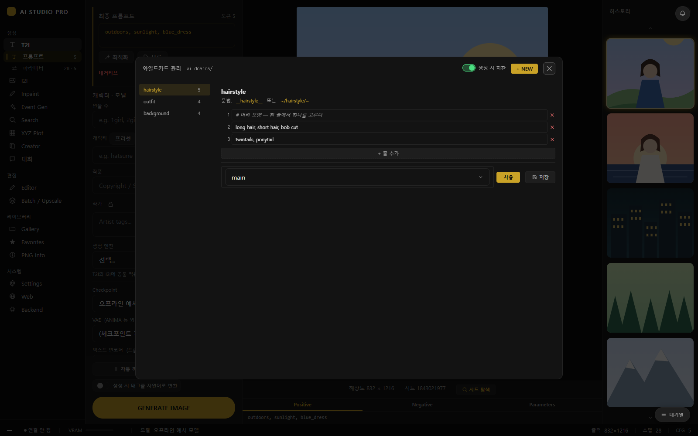
</p>
<p align="center"><sub>와일드카드 관리 창 — 왼쪽 파일 목록, 오른쪽 줄 편집 영역(<code>#</code> 주석 줄 포함)과 문법 안내(<code>__name__</code> / <code>~/name/~</code>), 아래쪽 삽입 대상 선택과 사용·저장 버튼</sub></p>

### 즉석 와일드카드

스튜디오 도구 → **즉석 WC**에서 이름별 후보 목록을 만들고 `$$name$$` 형태로 프롬프트에 넣습니다(`user_data/instant_wildcards.json`에 저장됩니다).

- 생성할 때마다 한 줄을 고르며, `{3}:tag`처럼 줄 앞에 가중치를 붙일 수 있습니다.
- 8단계까지 중첩되고, 없는 이름은 그대로 둡니다.
- `생성 시 치환` 스위치와 상관없이 항상 치환되고, 그 뒤에 중복 태그를 정리합니다.

실시간 프롬프트 정리(밑줄→공백 등)는 `$$name$$`, `~/name/~`, `__name__` 토큰을 건드리지 않습니다.

### 조건부 규칙

스튜디오 도구 → **조건부**에서 IF→THEN 규칙을 관리합니다(`config/cond_rules.json`, 전체 켜기/끄기).

| 항목 | 값 |
|---|---|
| 조건 | 태그 목록(콤마 = 모두 있어야 함), `있으면` / `없으면` |
| 대상 | 추가·제거·대체할 태그(콤마 목록) |
| 동작 | 긍정: 추가 / 제거 / 대체, 부정: 추가 / 제거 |
| 위치 | 본문 / 선행 / 후행 / 바로 뒤(긍정 규칙만) |

- 조건은 긍정 칸(캐릭터·작품·접두·메인·접미)에서만 확인하며, 태그를 소문자로 바꾸고 밑줄을 공백으로, 이스케이프된 괄호를 원래대로 되돌린 뒤 비교합니다.
- 추가는 이미 있는 태그를 다시 넣지 않고, 제거는 모든 긍정 칸에서 태그를 뺍니다. 대체는 조건 태그를 대상 태그로 바꾸는데, `없으면` 규칙에는 바꿀 태그가 없으므로 대체가 적용되지 않습니다.
- 조건은 규칙을 적용하기 전의 태그로 한 번만 평가하므로, 한 규칙이 바꾼 결과가 같은 회차의 다른 규칙을 발동시키지는 않습니다.
- 규칙은 데이터 태그를 프롬프트 칸에 채울 때 적용되며(와일드카드를 켰다면 치환한 뒤에 한 번 더), 생성 직전의 최종 프롬프트에는 적용되지 않습니다.
- 캐릭터 특징 프리셋에도 캐릭터별 규칙을 넣을 수 있습니다.

---

## ⌨️ 단축키

백엔드 선택 화면이 떠 있는 동안에는 전역 단축키가 모두 꺼집니다.

| 키 | 동작 |
|---|---|
| `Ctrl+G` | 생성 |
| `Ctrl+S` | 설정 저장 |
| `F5` | 히스토리 새로고침 |
| `Ctrl+Tab` / `Ctrl+Shift+Tab` | 레일 순서대로 다음/이전 탭 |
| `Esc` | 맨 위 모달 닫기. 모달이 없으면 파라미터 열을 닫고 프롬프트로 복귀 |
| `↑` / `↓` | 이전/다음 히스토리 이미지 (입력칸에 포커스가 없고 모달이 없을 때) |
| `Shift+↑` / `Shift+↓` | 히스토리 처음/끝 (수식키는 설정 → 단축키에서 Shift/Ctrl/Alt로 변경) |

**프롬프트 Undo/Redo**(`Ctrl+Z` / `Ctrl+Y` / `Ctrl+Shift+Z`)는 다음 경우에만 프롬프트 패널의 편집 기록에 적용됩니다.

- 포커스가 프롬프트 입력칸이나 패널 버튼에 있을 때
- 아무것도 포커스되지 않았고, 패널이 보이며 모달에 가려지지 않았을 때

그 밖의 입력칸(대화, 설정, 검색, 모달 등)에서는 브라우저 기본 Undo가 동작합니다. 자동완성 목록은 `↑↓`, `Tab`, `Enter`, `Esc`로 조작합니다.

| 화면 | 키 |
|---|---|
| Settings | `Ctrl+F` 설정 검색 (설정 화면에 포커스가 있을 때) |
| Editor | `Ctrl+O` 열기, `Ctrl+V` 붙여넣기, `Ctrl+S` 저장(덮어쓰기, 전역 `설정 저장`도 함께 실행), `Ctrl+Shift+S` 다른 이름으로 저장, `Ctrl+Z` / `Ctrl+Y` / `Ctrl+Shift+Z` 되돌리기·다시 하기(마스크가 우선), `Esc` 원근 보정 취소·선택 해제 |
| Editor 도구 | `M` 사각 선택 · `L` 올가미 · `B` 마스크 브러시 · `E` 지우개 · `S` 스탬프 · `P` 펜 · `N` 직선 · `R` 사각형 · `O` 원·타원 · `G` 채우기 · `I` 스포이트 · `Y` 클론 스탬프 · `T` 텍스트 · `D` 그라디언트 · `J` 복원 브러시 |
| Inpaint | `M` 사각 선택 · `L` 올가미 · `B` 마스크 브러시 · `E` 지우개 |
| 대화 | `Ctrl+N` 새 스레드 |

전체 안내는 설정 → **단축키**에서 볼 수 있습니다.

---

## 🗄️ 설정·데이터 위치

| 위치 | 내용 |
|---|---|
| `config/` | 앱 설정과 경로<br>대표 파일: `ui_prefs.json`(UI 설정의 기준 파일), `prompt_settings.json`, `backend_runtime.json`, `forge_model_paths.json`, `cond_rules.json`, `global_weights.json`, `chat_threads.json`, `instruction_presets.json`, `app_update.json`<br>폴더: `profiles/`, `workflows/` |
| `user_data/` | 사용자 자료(git 추적 제외). 즐겨찾기, 프롬프트 기록, 캐릭터 프리셋, `instant_wildcards.json`, `stats/generation.json`, `creator/`, `generation_api.json`(토큰), `managed_backends/`, `models/`, Web 탭 프로필 |
| `cache/` | 런타임 자료(마지막 검색 결과, 대기열·세션 복구, Web 탭 캐시)<br>지워도 앱은 동작하지만 남은 대기열과 복구할 세션은 사라짐 |
| `logs/` | `last_crash.log`(데스크톱), `last_crash_web.log`(웹 모드), 이전 크래시 로그 `last_crash.previous-*.log`, `updates/` |
| `app.log` | 로그 파일(10 MB × 5개 순환). 저장소 루트에 생성, 위치는 `AISTUDIO_LOG_FILE`로 변경 |
| `image_cache/` | 썸네일 캐시 `thumbs_v2/`, 편집기 임시 파일, SAM3 어휘 파일 |
| `web_profile/` · `backend_ui_cache/` | Vue 화면과 Backend 탭의 Chromium 프로필(localStorage 유지) |
| `generated_images/` | 기본 출력 폴더 |
| `wildcards/` | 와일드카드 파일(예시 `hairstyle.txt`, `test.txt` 포함) |
| `presets/` | 생성 프리셋. 새로 clone한 저장소에는 없고 첫 프리셋을 저장할 때 생성 |
| `Editor_models/` | YOLO·SAM 체크포인트. git 추적 제외(가중치 `*.pt` 등과 `yolo_config.json`은 무시 대상), 앱이 처음 필요할 때 폴더 생성 |

- 예전 위치에 있던 설정 파일은 처음 읽을 때 새 위치로 자동으로 옮겨집니다.
- 설정 → **데이터 · 백업**은 `config/`·`user_data/`의 설정 파일과 `presets/`, `wildcards/` 폴더를 함께 백업합니다(대화 기록 포함 여부는 선택할 수 있습니다).

---

## 🩺 문제 해결

| 증상 | 확인할 것 |
|---|---|
| 앱이 뜨지 않고 꺼짐 | 콘솔 메시지와 `logs/last_crash.log`(웹 모드는 `logs/last_crash_web.log`), `app.log` 확인 |
| 첫 실행이 패키지 설치에서 멈춤 | CUDA torch 설치에 실패하면 앱이 시작되지 않으므로 네트워크 확인, 필요하면 `core/check_requirements.py`의 `_TORCH_CUDA_INDEX` 조정 |
| 첫 실행 때 데이터를 받지 못함 | 오프라인이면 첫 설치 때 앱이 시작되지 않으므로, 인터넷에 연결한 뒤 다시 실행하거나 [데이터 다시 받기](#데이터-다시-받기) 진행 |
| 백엔드 선택 화면이 '연결 실패'로 닫히지 않음 | 백엔드가 실행 중인지, Forge는 `--api`로 띄웠는지, 주소와 포트가 맞는지 확인 |
| ComfyUI에서 '필요한 노드가 없습니다' 오류 | [동봉 노드 팩](#백엔드-연결) 설치 후 ComfyUI 재시작 |
| Hugging Face 접근 거부 | venv를 활성화한 창에서 `hf auth login` 실행, 저장소 페이지(예: `facebook/sam3`)에서 접근 승인 |

---

## 📁 디렉터리 구조

```
.
├── new_main_ui.py          # 데스크톱 진입점
├── web_main_ui.py          # 웹 모드 진입점
├── new_run_main_ui.bat     # 기본 런처 (venv 생성·복구, pip 준비)
├── run_gui.bat             # 데스크톱 실행 (기존 venv)
├── run_WEB_gui.bat         # 웹 모드 실행 (기존 venv)
├── config.py               # 경로 상수
├── requirements.txt · VERSION · run_tests.py
├── ui/                     # QMainWindow(generator_*.py 믹스인), VueBridge, 위젯 프록시, *_actions.py
├── backends/               # WebUIBackend(A1111/Forge) · ComfyUIBackend + 진행률/미리보기
├── core/                   # Qt 없는 순수 로직
├── workers/                # QThread 워커
├── utils/                  # 로거, 와일드카드, 조건부 규칙, 태그 자동완성, 테마 등
├── tabs/                   # Web·Backend 네이티브 화면
├── widgets/                # 대기열 상태(QObject) — QueuePanel·QueueManager
├── frontend/               # Vue 3 + Vite 소스 (src/, dev/)
├── frontend_dist/          # Vue 빌드 결과 (커밋됨)
├── comfy_custom_nodes/     # 동봉 ComfyUI 노드 팩 ai_studio_forge_parity
├── danbooru_optimized/     # Danbooru 데이터 (parquet는 자동 다운로드)
├── tags_db/                # 태그 DB (git 추적)
├── wildcards/              # 와일드카드 파일
├── config/                 # 설정 (참고용 목록 등 일부만 추적)
├── docs/                   # 기능 문서
├── design/                 # 디자인 캔버스
├── tests/                  # 백엔드 테스트 (unittest)
├── tools/                  # 데이터 재생성, 테마 CSS 생성, 테스트 훅
├── scripts/                # CPU 스모크 스크립트
├── assets/                 # 아이콘
└── CLAUDE.md · AGENTS.md   # 개발 지침
```

---

## 🔧 개발

작업 지침은 [`CLAUDE.md`](CLAUDE.md)에 있습니다. [`AGENTS.md`](AGENTS.md)는 같은 필수 규칙에 핵심 파일 표를 더한 문서이므로, 한쪽을 고치면 다른 쪽도 맞춰 주세요.
git과 빌드 명령은 모두 저장소 루트에서 실행하세요.

### 검증 명령

```bat
:: 백엔드 전체 (표준 unittest, pytest 불필요)
venv\Scripts\python.exe run_tests.py
:: 느린 통합 테스트·torch 테스트 제외
venv\Scripts\python.exe run_tests.py --quick
:: 모듈별 실행 시간·import 시간 측정
venv\Scripts\python.exe run_tests.py --durations 15
```

```bat
cd frontend
:: vitest (src/**/*.test.ts)
npm run test
:: node --test (src/studio/*.test.mjs)
npm run test:node
:: vue-tsc --noEmit, 0 errors 유지
npm run type-check
:: ../frontend_dist로 빌드
npm run build
```

- 반드시 venv의 Python을 사용하세요. PATH의 다른 Python에는 PyQt6·pandas 등이 없어서 가짜 ImportError가 납니다.
  `run_tests.py`는 venv 밖에서 실행되면 venv로 다시 실행하지만(`URIV_TESTS_REEXEC=1`로 끌 수 있습니다), `py_compile` 같은 다른 명령에는 이런 장치가 없습니다.
- `--include MODULE`은 `--quick`에서 뺀 느린 모듈만 다시 넣습니다. 느린 모듈 목록은 `run_tests.py`의 `SLOW_MODULES`에 있고, `--with-torch`를 붙이면 `--quick`에서도 torch 테스트를 실행합니다.
- Vue를 수정했다면 `npm run build` 결과인 `frontend_dist/`도 함께 커밋하고, `frontend/src/utils/`의 순수 로직을 고쳤다면 `npm run test`도 실행하세요.

### 계약 테스트

| 테스트 | 지키는 것 |
|---|---|
| `tests/test_bridge_contract.py` | Vue 액션·이벤트 이름과 Python 핸들러·시그널의 양방향 일치. Python 전용 이름은 `PYTHON_INTERNAL`, 정리 예정 이름은 `PENDING`(사유 필수)에 기록 |
| `tests/test_web_mode_security.py` | 웹 모드 인증, 파일 전송, 허용 목록 |
| `tests/test_component_emit_contract.py` | 컴포넌트가 선언한 emit을 부모가 실제로 바인딩하는지 |
| `frontend/src/App.templateBindings.test.ts` | 템플릿이 쓰는 이름이 `<script setup>`에 모두 정의돼 있는지 |
| `frontend/src/types/bridgePayloads.test-d.ts` | 브리지 페이로드 타입 강제가 살아 있는지(`type-check`로 검사) |

### 규칙

- 새 기능은 거대 파일에 더하지 않습니다. 프론트는 `frontend/src/composables/use*.ts`에, 백엔드 순수 로직은 `core/`·`utils/`에 따로 만들고 테스트를 함께 둡니다.
- 커밋 메시지는 한국어 conventional 형식(`feat:` / `fix:` / `refactor:` / `test:` / `chore:` / `docs:`)을 따릅니다.
- 런타임 데이터(`config/cond_rules.json`, `config/char_global_prefs.json`, `cache/session/session_backup.json`)와 API 키·토큰은 커밋하지 않습니다.
- `.bat`/`.cmd` 파일은 CRLF로 저장합니다(`.gitattributes`와 `tests/test_line_ending_policy.py`가 강제합니다).

---

## 라이선스

MIT

동봉 ComfyUI 노드 팩에 들어 있는 제3자 코드의 라이선스는 [`comfy_custom_nodes/ai_studio_forge_parity/LICENSES/`](comfy_custom_nodes/ai_studio_forge_parity/LICENSES/)에 있습니다.
